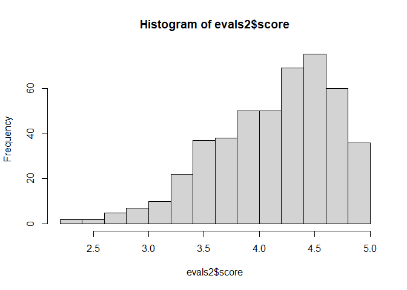
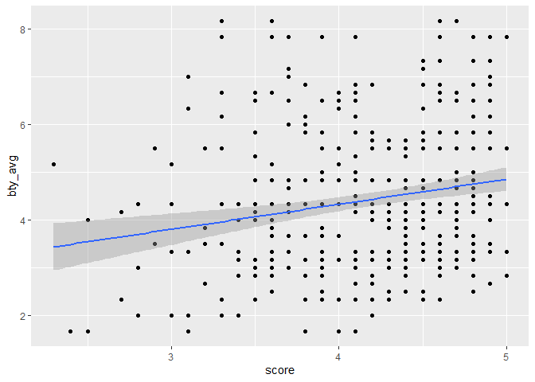
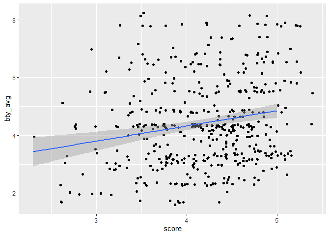
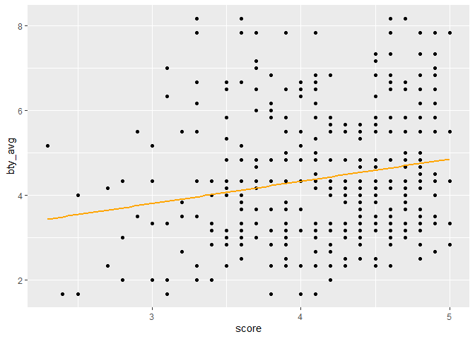

Lab 09 - Grading the professor, Pt. 1
================
Insert your name here
Insert date here

### Load packages and data

``` r
library(tidyverse) 
library(tidymodels)
library(openintro)
```

### Exercise 1-3

``` r
evals2 <- evals

print(head(evals2,10))
```

    ## # A tibble: 10 x 23
    ##    course_id prof_id score rank    ethnicity gender language   age cls_perc_eval
    ##        <int>   <int> <dbl> <fct>   <fct>     <fct>  <fct>    <int>         <dbl>
    ##  1         1       1   4.7 tenure~ minority  female english     36          55.8
    ##  2         2       1   4.1 tenure~ minority  female english     36          68.8
    ##  3         3       1   3.9 tenure~ minority  female english     36          60.8
    ##  4         4       1   4.8 tenure~ minority  female english     36          62.6
    ##  5         5       2   4.6 tenured not mino~ male   english     59          85  
    ##  6         6       2   4.3 tenured not mino~ male   english     59          87.5
    ##  7         7       2   2.8 tenured not mino~ male   english     59          88.6
    ##  8         8       3   4.1 tenured not mino~ male   english     51         100  
    ##  9         9       3   3.4 tenured not mino~ male   english     51          56.9
    ## 10        10       4   4.5 tenured not mino~ female english     40          87.0
    ## # ... with 14 more variables: cls_did_eval <int>, cls_students <int>,
    ## #   cls_level <fct>, cls_profs <fct>, cls_credits <fct>, bty_f1lower <int>,
    ## #   bty_f1upper <int>, bty_f2upper <int>, bty_m1lower <int>, bty_m1upper <int>,
    ## #   bty_m2upper <int>, bty_avg <dbl>, pic_outfit <fct>, pic_color <fct>

``` r
## 1
hist(evals2$score)
```

<!-- -->

``` r
##2

evals2 %>%
  ggplot( mapping=aes(x=score, y=bty_avg)) +
  geom_point()+
  stat_smooth(method=lm)
```

    ## `geom_smooth()` using formula 'y ~ x'

<!-- -->

``` r
##3

evals2 %>%
  ggplot( mapping=aes(x=score, y=bty_avg)) +
  geom_jitter(width=0.4)+ # generating random varaible and jitter the dots. 
  stat_smooth(method=lm)
```

    ## `geom_smooth()` using formula 'y ~ x'

<!-- -->

### Exercise 4-8

``` r
##4
m_bty<-lm(score~bty_avg, evals2)
summary(m_bty)
```

    ## 
    ## Call:
    ## lm(formula = score ~ bty_avg, data = evals2)
    ## 
    ## Residuals:
    ##     Min      1Q  Median      3Q     Max 
    ## -1.9246 -0.3690  0.1420  0.3977  0.9309 
    ## 
    ## Coefficients:
    ##             Estimate Std. Error t value Pr(>|t|)    
    ## (Intercept)  3.88034    0.07614   50.96  < 2e-16 ***
    ## bty_avg      0.06664    0.01629    4.09 5.08e-05 ***
    ## ---
    ## Signif. codes:  0 '***' 0.001 '**' 0.01 '*' 0.05 '.' 0.1 ' ' 1
    ## 
    ## Residual standard error: 0.5348 on 461 degrees of freedom
    ## Multiple R-squared:  0.03502,    Adjusted R-squared:  0.03293 
    ## F-statistic: 16.73 on 1 and 461 DF,  p-value: 5.083e-05

``` r
##5,6, 7, 8 
evals2 %>%
  ggplot( mapping=aes(x=score, y=bty_avg)) +
  geom_point()+
  stat_smooth(method=lm, se=FALSE, color="orange")
```

    ## `geom_smooth()` using formula 'y ~ x'

<!-- -->

Model R^2 = 0.035 this model explain the 3.5% of the total variance.

bty\_avg is significant predictor for the score. intercept is 3.388 This
meas that if the bty\_avg=0, the score is 3.88034

## Exercise 9-15

``` r
##9
m_gen<-lm(score~as.factor(gender), evals2)
summary(m_gen)
```

    ## 
    ## Call:
    ## lm(formula = score ~ as.factor(gender), data = evals2)
    ## 
    ## Residuals:
    ##      Min       1Q   Median       3Q      Max 
    ## -1.83433 -0.36357  0.06567  0.40718  0.90718 
    ## 
    ## Coefficients:
    ##                       Estimate Std. Error t value Pr(>|t|)    
    ## (Intercept)            4.09282    0.03867 105.852  < 2e-16 ***
    ## as.factor(gender)male  0.14151    0.05082   2.784  0.00558 ** 
    ## ---
    ## Signif. codes:  0 '***' 0.001 '**' 0.01 '*' 0.05 '.' 0.1 ' ' 1
    ## 
    ## Residual standard error: 0.5399 on 461 degrees of freedom
    ## Multiple R-squared:  0.01654,    Adjusted R-squared:  0.01441 
    ## F-statistic: 7.753 on 1 and 461 DF,  p-value: 0.005583

``` r
##10
m_rank<-lm(score~as.factor(rank), evals2)
summary(m_rank)
```

    ## 
    ## Call:
    ## lm(formula = score ~ as.factor(rank), data = evals2)
    ## 
    ## Residuals:
    ##     Min      1Q  Median      3Q     Max 
    ## -1.8546 -0.3391  0.1157  0.4305  0.8609 
    ## 
    ## Coefficients:
    ##                             Estimate Std. Error t value Pr(>|t|)    
    ## (Intercept)                  4.28431    0.05365  79.853   <2e-16 ***
    ## as.factor(rank)tenure track -0.12968    0.07482  -1.733   0.0837 .  
    ## as.factor(rank)tenured      -0.14518    0.06355  -2.284   0.0228 *  
    ## ---
    ## Signif. codes:  0 '***' 0.001 '**' 0.01 '*' 0.05 '.' 0.1 ' ' 1
    ## 
    ## Residual standard error: 0.5419 on 460 degrees of freedom
    ## Multiple R-squared:  0.01163,    Adjusted R-squared:  0.007332 
    ## F-statistic: 2.706 on 2 and 460 DF,  p-value: 0.06786

``` r
m_rank<-lm(score~as.factor(rank), evals2)
summary(m_rank)
```

    ## 
    ## Call:
    ## lm(formula = score ~ as.factor(rank), data = evals2)
    ## 
    ## Residuals:
    ##     Min      1Q  Median      3Q     Max 
    ## -1.8546 -0.3391  0.1157  0.4305  0.8609 
    ## 
    ## Coefficients:
    ##                             Estimate Std. Error t value Pr(>|t|)    
    ## (Intercept)                  4.28431    0.05365  79.853   <2e-16 ***
    ## as.factor(rank)tenure track -0.12968    0.07482  -1.733   0.0837 .  
    ## as.factor(rank)tenured      -0.14518    0.06355  -2.284   0.0228 *  
    ## ---
    ## Signif. codes:  0 '***' 0.001 '**' 0.01 '*' 0.05 '.' 0.1 ' ' 1
    ## 
    ## Residual standard error: 0.5419 on 460 degrees of freedom
    ## Multiple R-squared:  0.01163,    Adjusted R-squared:  0.007332 
    ## F-statistic: 2.706 on 2 and 460 DF,  p-value: 0.06786

``` r
table(evals2$rank)
```

    ## 
    ##     teaching tenure track      tenured 
    ##          102          108          253

``` r
##11

evals2<-evals2 %>%
  mutate(rankre = relevel(rank,ref="tenure track" ))

ref_rank<-lm(score~ rankre, evals2)
summary(ref_rank)
```

    ## 
    ## Call:
    ## lm(formula = score ~ rankre, data = evals2)
    ## 
    ## Residuals:
    ##     Min      1Q  Median      3Q     Max 
    ## -1.8546 -0.3391  0.1157  0.4305  0.8609 
    ## 
    ## Coefficients:
    ##                Estimate Std. Error t value Pr(>|t|)    
    ## (Intercept)     4.15463    0.05214  79.680   <2e-16 ***
    ## rankreteaching  0.12968    0.07482   1.733   0.0837 .  
    ## rankretenured  -0.01550    0.06228  -0.249   0.8036    
    ## ---
    ## Signif. codes:  0 '***' 0.001 '**' 0.01 '*' 0.05 '.' 0.1 ' ' 1
    ## 
    ## Residual standard error: 0.5419 on 460 degrees of freedom
    ## Multiple R-squared:  0.01163,    Adjusted R-squared:  0.007332 
    ## F-statistic: 2.706 on 2 and 460 DF,  p-value: 0.06786

``` r
evals2 <- evals2 %>%
  mutate(tenure_eligible = case_when(
    rank == "teaching" ~ "no",
    rank == "tenure track" ~ "yes",
    rank == "tenured" ~ "yes"
  ))

m_tenure_eligible<-lm(score~as.factor(tenure_eligible), evals2)
summary(m_tenure_eligible)
```

    ## 
    ## Call:
    ## lm(formula = score ~ as.factor(tenure_eligible), data = evals2)
    ## 
    ## Residuals:
    ##     Min      1Q  Median      3Q     Max 
    ## -1.8438 -0.3438  0.1157  0.4360  0.8562 
    ## 
    ## Coefficients:
    ##                               Estimate Std. Error t value Pr(>|t|)    
    ## (Intercept)                     4.2843     0.0536  79.934   <2e-16 ***
    ## as.factor(tenure_eligible)yes  -0.1406     0.0607  -2.315    0.021 *  
    ## ---
    ## Signif. codes:  0 '***' 0.001 '**' 0.01 '*' 0.05 '.' 0.1 ' ' 1
    ## 
    ## Residual standard error: 0.5413 on 461 degrees of freedom
    ## Multiple R-squared:  0.0115, Adjusted R-squared:  0.009352 
    ## F-statistic: 5.361 on 1 and 461 DF,  p-value: 0.02103

male 4.092982 + 0.14151 female 4.092982 + 0

teaching: 4.28 + 0 tenured: 4.28 - 0.12968 tenured track : 4.28-0.14518

tenure track = 4.15 teacing = 4.15+0.129 tenured = 4.15-0.01550

R^2=0.01 this model explain 1% of the variance in the DV No = 4.28 Yes =
4.28 - 0.1406
